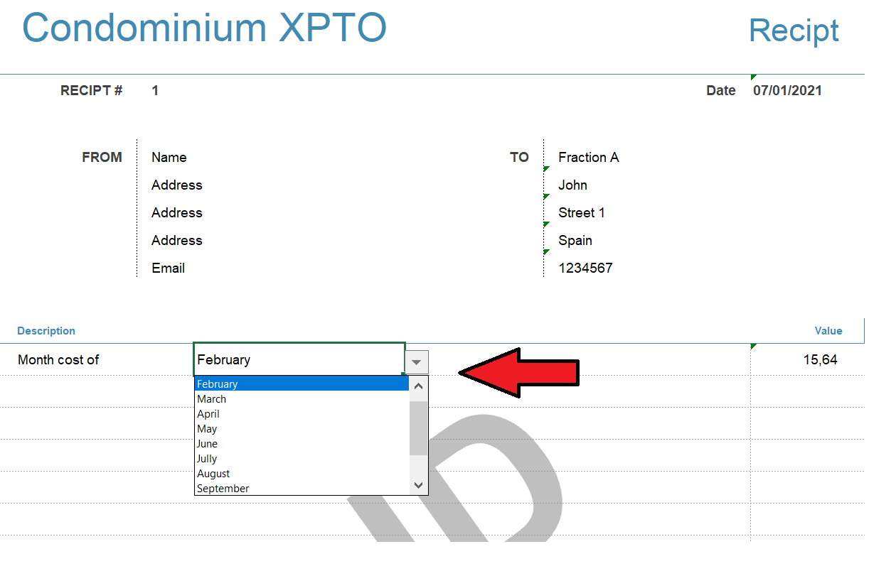
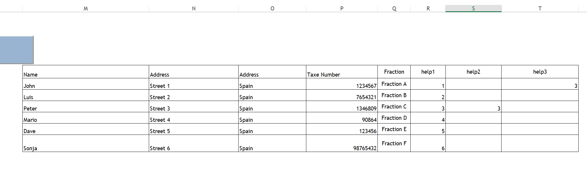
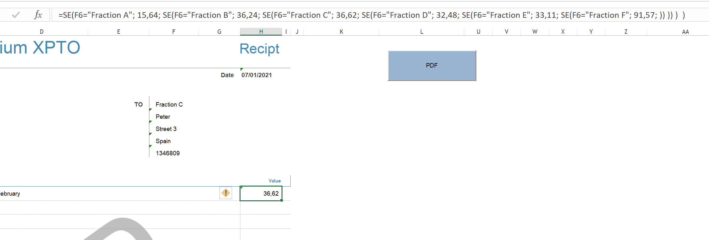
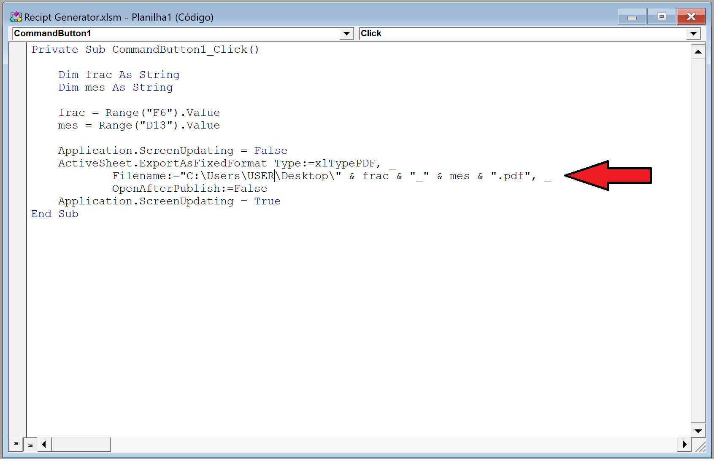

# Recipt Generator (.xlsm)

This [vba](https://www.excel-easy.com/vba.html) project was developed to help me manage my condominium.  
Every month it’s supposed send a receipt to each neighbor as soon the monthly payment is received. This receipt is just a prove that the manager receives the payment.

The template allows you:
- Insert the name of your condominium
- Insert information about condominium in "From" (address, phone number, email)
- The date is automatically updated as soon you open the file (present date)
- You can add the information about each neighbor (fraction, address, monthly cost)
- You can choose the month that the receipt refers
- When the file is finished, you can generate a pdf file just hitting the button

**Choose month that the recipt refers**

Simple choose the month in the list.

**Neighbor Information**

:heavy_exclamation_mark: To add information unhide the collums M to T.

**Value of each Fraction**

Simply select cell H13 and check the function.

**Location of generated PDF**

Select Developer Tab to check the vba code and then Visual Basic.

Enjoy :smile:

